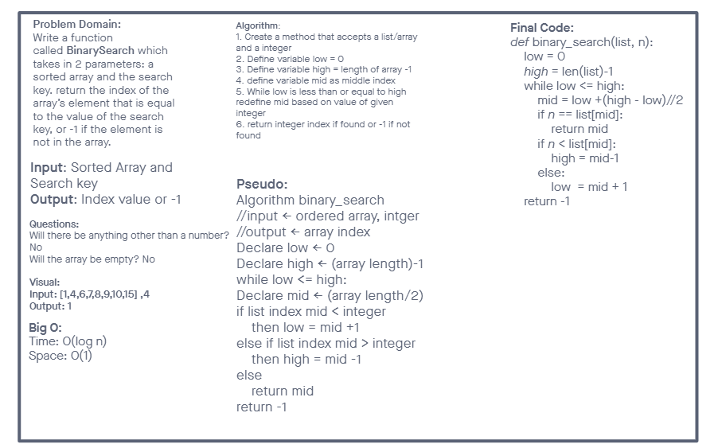

# Binary Search

- Write a function called `BinarySearch` which takes in 2 parameters: a sorted array and the search key. Without utilizing any of the built-in methods available to your language, return the index of the array’s element that is equal to the value of the search key, or -1 if the element is not in the array.

## Whiteboard Process

- Developed by: Chris Rarig and Jordan Flemming

## Approach & Efficiency

- Jordan and I decided to take the driver and instructor approach to this white-board switching roles every two topics.
- For the code we decided it was necessary to factor in the mid length of the array and then using a while loop continue to dictate that mid variable based on whether or not the give number was greater than or less than.