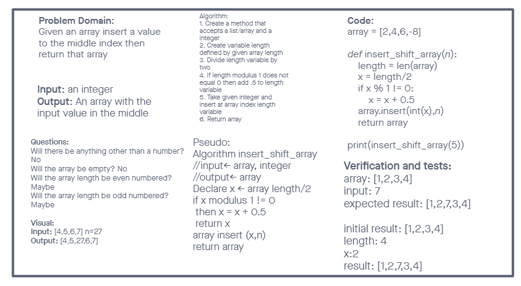

# Reverse an Array

- Write a function called `insertShiftArray` which takes in an array and a value to be added. Without utilizing any of the built-in methods available to your language, return an array with the new value added at the middle index.

## Whiteboard Process

- Developed by: Chris Rarig and Taylor White

## Approach & Efficiency

- Taylor and I decided to take the driver and instructor approach to this white-board switching roles every two topics.
- For the code we decided it was necessary to factor in the length of the array in order to find the correct index value to insert the given number at.