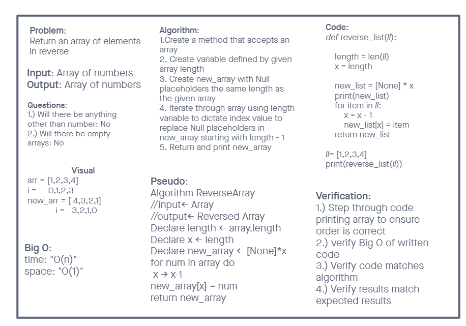

# Reverse an Array

- Write a function called `reverseArray` which takes an array as an argument. Without utilizing any of the built-in methods available to your language, return an array with elements in reversed order.

## Whiteboard Process

- Developed by: Chris Rarig and Joshua Houston

## Approach & Efficiency

- Used the length of the given array to design an new array in which we assigned the reverse index of given array objects to new array.
- We found using a new array and the length of the given array to be the simplest and most efficient approach