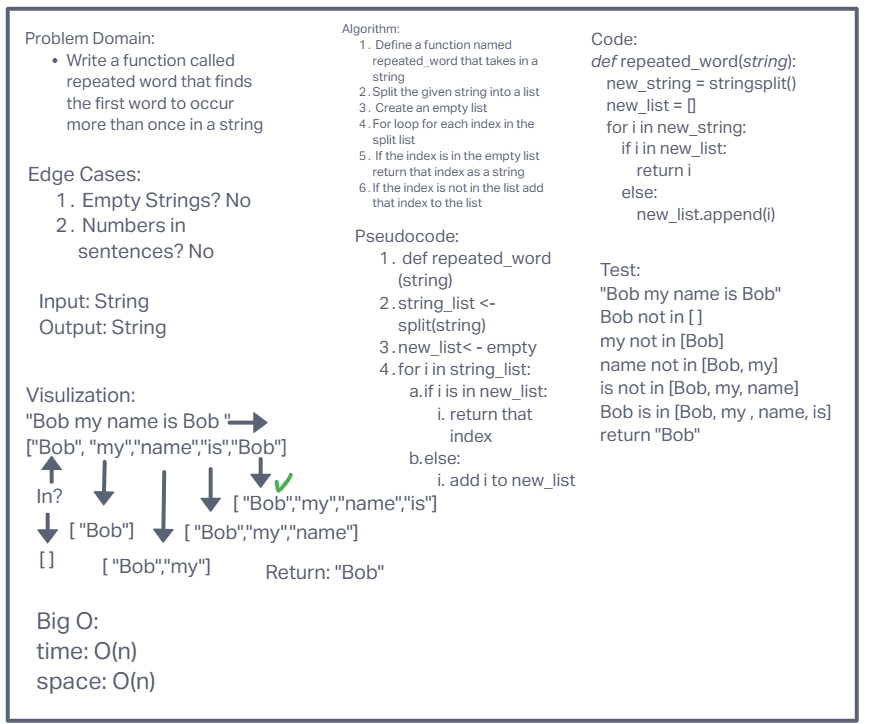

# Hashmap-Repeated-Word

- Write a function called repeated word that finds the first word to occur more than once in a string
- Arguments: string
- Return: string

## Whiteboard Process

## Approach & Efficiency

- Initially I took a list index comparison after formating the string into a list.This worked for the initial challenge but I converted into a dictionary for the stretch goal

## Solution

- The code will run correctly when given a string of words greater than one word. If it is one word it will return that word. If it is greater than one word the words are split and put into a dictionary. Then the words are compared to what is in the dictionary and if it is already in the dictionary that index is returned