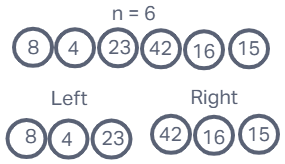
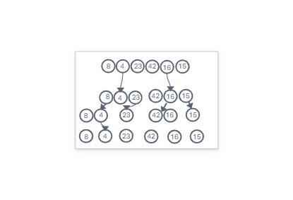
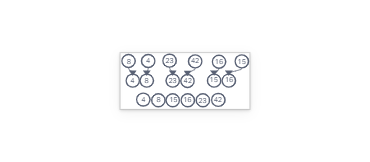

# Merge Sort

## Overview

- Given the pseudocode below we will be looking through how this code works from iteration to iteration with the given list

- Pseudocode:

```
ALGORITHM Mergesort(arr)
    DECLARE n <-- arr.length

    if n > 1
      DECLARE mid <-- n/2
      DECLARE left <-- arr[0...mid]
      DECLARE right <-- arr[mid...n]
      // sort the left side
      Mergesort(left)
      // sort the right side
      Mergesort(right)
      // merge the sorted left and right sides together
      Merge(left, right, arr)

ALGORITHM Merge(left, right, arr)
    DECLARE i <-- 0
    DECLARE j <-- 0
    DECLARE k <-- 0

    while i < left.length && j < right.length
        if left[i] <= right[j]
            arr[k] <-- left[i]
            i <-- i + 1
        else
            arr[k] <-- right[j]
            j <-- j + 1

        k <-- k + 1

    if i = left.length
       set remaining entries in arr to remaining values in right
    else
       set remaining entries in arr to remaining values in left
```

- Input List: `[8,4,23,42,16,15]`

## Walk Through

- 

## Mergesort(arr)

- First we define `n` as the length of the given list. If `n>1` then we assign `mid = n/2`, `left = arr[:mid]` and `right = arr[mid:]`. 
- After assigning these variables we then recursively call `Mergesort(arr)` for both the `left` and `right` variables.
- This occurs until the size of the `right` and `left` arrays are 1
- 
- We then call the `Merge(left, right, arr)`

## Merge(left,right,arr)

- First we define `i = 0`, `j = 0`, and `k = 0`
- Then we start a while loop.
  - while `i < left.length` and `j < right.length`:
    - if `left[i]` is less than or equal too `right[j]` then
      - `arr[k]` = `left[i]`
      - `i` is set to `i + 1`
    - else
      - `arr[k]` = `right[i]`
      - `j` is set to `j + 1`
    - then `k` is set to `k + 1`
  - if `i` is equal to the length of `left` then `arr = right`
  - else `arr = left`
- 
- This then gives us our output: `[4,8,15,16,23,42]`