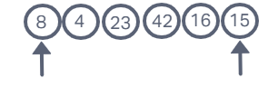
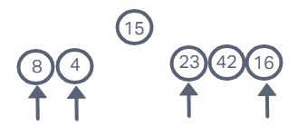
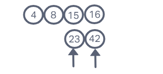

# Quick Sort

- Quick sort is a divide and conquer sorting method. It uses a pivot point and sorts around that point. Given the pseudocode below we will demonstrate quick sort.

## Pseudocode

```
ALGORITHM QuickSort(arr, left, right)
    if left < right
        // Partition the array by setting the position of the pivot value
        DEFINE position <-- Partition(arr, left, right)
        // Sort the left
        QuickSort(arr, left, position - 1)
        // Sort the right
        QuickSort(arr, position + 1, right)

ALGORITHM Partition(arr, left, right)
    // set a pivot value as a point of reference
    DEFINE pivot <-- arr[right]
    // create a variable to track the largest index of numbers lower than the defined pivot
    DEFINE low <-- left - 1
    for i <- left to right do
        if arr[i] <= pivot
            low++
            Swap(arr, i, low)

     // place the value of the pivot location in the middle.
     // all numbers smaller than the pivot are on the left, larger on the right.
     Swap(arr, right, low + 1)
    // return the pivot index point
     return low + 1

ALGORITHM Swap(arr, i, low)
    DEFINE temp;
    temp <-- arr[i]
    arr[i] <-- arr[low]
    arr[low] <-- temp
```

## Input

- Sample Input: `[8,4,23,42,16,15]`

## Trace

1. Pass One
 

- In this first pass we identify 15 as our pivot point and compare it to each index. This is then divided into two arrays *left*(less than): `[8,4]` and *Right*(greater than): `[23,42,16]`.

2. Pass Two
 

- In this pass we have established 15 as a permanent element and recursively run the *Left* and *Right* arrays established above. This process is the same. In the *Left* we compare 4 to 8 and make a swap between those two due to value. In the *Right* we compare 16 to 23 and 42. Both 23 and 42 are greater than 16 and this will cause another pass.

3. Pass Three
 

- In this pass we have established `[4,8,15,16]` due to interactions on our last pass. We are now going to compare 42 to 23. Since 42 is larger than 23 no swap will occur and these values will join the established values.

## Output

- Sample Output: `[8,4,15,16,23,42]`

## Big 'O'

- *Time*: O(N2)
- *Space*: O(1)