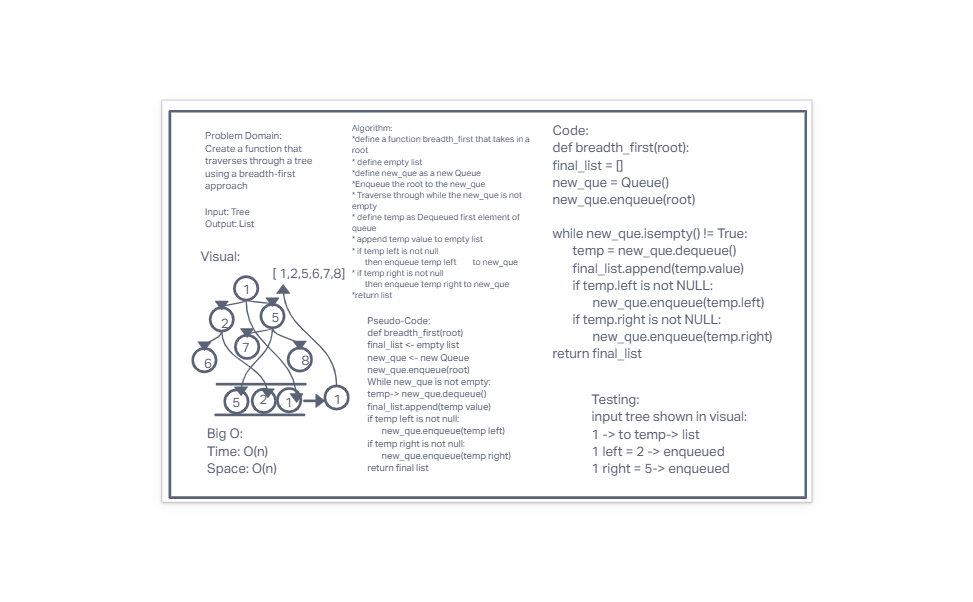

# Code Challenge 17

# Challenge Summary

- Write a function called breadth first
- Arguments: tree
- Return: list of all values in the tree, in the order they were encountered

## Whiteboard Process

## Approach & Efficiency

- I used a queue to hold the items needed to be evaluated. Using a while loop and queue functions I was able to evaluate the right and left children of each node and append them to a list
- Big O:
  - Space - O(n)
  - Time - O(n)

## Solution
<!-- Show how to run your code, and examples of it in action -->