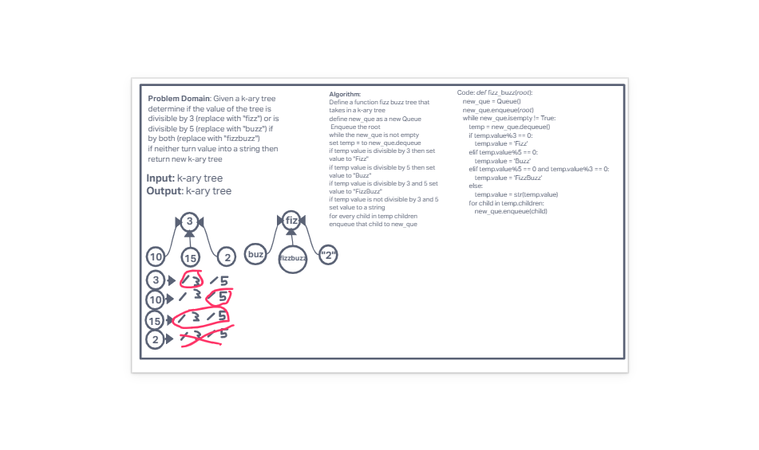

# Code Challenge 17

## Challenge Summary

- Write a function called fizz buzz tree
  - Determine whether or not the value of each node is divisible by 3, 5 or both
  - If the value is divisible by 3, replace the value with “Fizz”
  - If the value is divisible by 5, replace the value with “Buzz”
  - If the value is divisible by 3 and 5, replace the value with “FizzBuzz”
  - If the value is not divisible by 3 or 5, simply turn the number into a String.
- Arguments: k-ary tree
- Return: k-ary tree

## White-board Process

## Approach & Efficiency

- I used a queue to hold the items needed to be evaluated. Using a while loop and queue functions I was able to evaluate the children of each node and append them to a list
- Big O:
  - Space - O(n)
  - Time - O(n)

## Solution
<!-- Show how to run your code, and examples of it in action -->