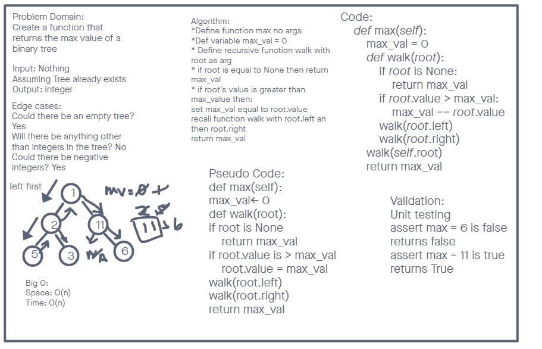

# Trees

- Binary Tree and BST Implementation

## Challenge 15

- PR: https://github.com/chrisrarig1/data-structures-and-algorithms/pull/32

### Binary Tree

- Create a Node class that has properties for the value stored in the node, the left child node, and the right child node.
- Create a Binary Tree class
  - Define a method for each of the depth first traversals:
    - pre order
    - in order
    - post order which returns an array of the values, ordered appropriately.

### Binary Search Tree

- Create a Binary Search Tree class
  - This class should be a sub-class (or your languages equivalent) of the Binary Tree Class, with the following additional methods:
    - Add:
      - Arguments: value
      - Return: nothing
      - Adds a new node with that value in the correct location in the binary search tree.
    - Contains:
      - Argument: value
      - Returns: boolean indicating whether or not the value is in the tree at least once.

## Approach & Efficiency

- I took a test development method approach to the function creation and used a recursive method for a required functions

## API

- Pre Order, In Order, and Post Order are all depth first traversals that return the tree in list form and in a certain order
- Add takes in a value and depending on whether or not it is greater than or less than the root gets places on the right or left of the tree
- Contains is a boolean function that checks for a number inside the tree and returns the boolean answer

## Challenge 16

### Max Function

- PR: https://github.com/chrisrarig1/data-structures-and-algorithms/pull/33

- Create a function called max that returns the max value in a tree

## Approach & Efficiency

- I looked at some of the previous functions to iterate through the tree and manipulated the post order function to allow for the return of a max value. I did have to create a global max value variable

## API

The max function looks at the current node value of the tree and if that node value is greater than the global max value variable it replaces it. Then we check the rest of the tree starting with the left children and then the right. Returning the max value variable