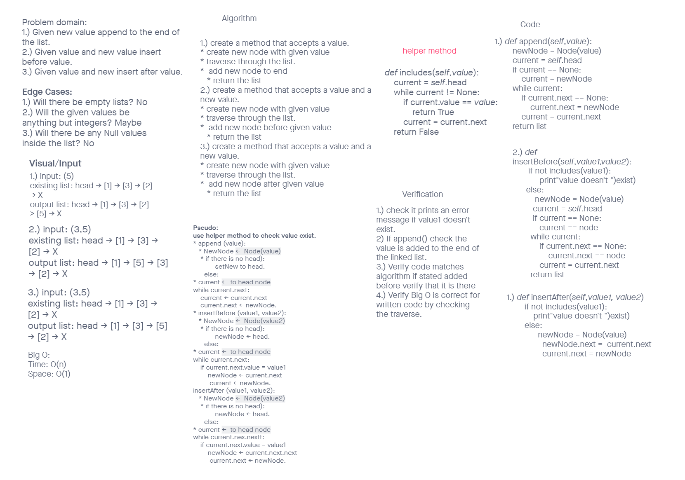
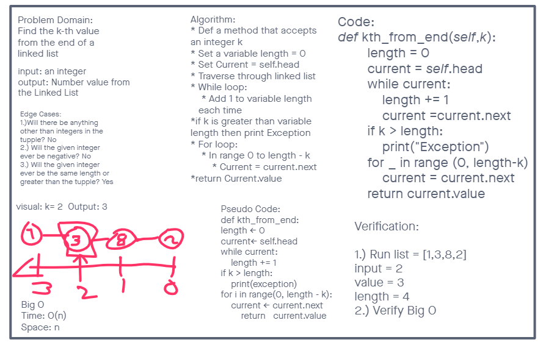

# Singly Linked List

## Code Challenge 05

### Node

1. Create a Node class that has properties for the value stored in the Node, and a pointer to the next Node.

### Linked List

1. Create a Linked List class
    - Within your Linked List class, include a head property.
        - Upon instantiation, an empty Linked List should be created.
2. The class should contain the following methods
    - insert
        - Arguments: value
        - Returns: nothing
        - Adds a new node with that value to the head of the list with an O(1) Time performance.
    - includes
        - Arguments: value
        - Returns: Boolean
            - Indicates whether that value exists as a Node’s value somewhere within the list.
    - to string
        - Arguments: none
        - Returns: a string representing all the values in the Linked List, formatted as: "{ a } -> { b } -> { c } -> NULL"

## API

- `insert()` this method inserts a new node to a linked list
- `includes()` this method checks to see if a value is included in the linked list
- `__str__` this method prints out the linked list in string form

## Code Challenge 06

- Extend a Linked List to allow various insertion methods.
  - append
    - arguments: new value
    - adds a new node with the given value to the end of the list
  - insert before
    - arguments: value, new value
    - adds a new node with the given new value immediately before the first node that has the value specified
  - insert after
    - arguments: value, new value
    - adds a new node with the given new value immediately after the first node that has the value specified

- Authors: Chris Rarig and Edris Berg

## Approach & Efficiency

- I felt that the test development coding method was the best approach to this.
- I created the classes but left the functions blank until after I wrote the tests
- Big O time was O(n) and Space O(1)

## API

- `append()` this method inserts a value at the end of the list
- `insert_before()` this method inserts before a given value
- `insert_after()` this method inserts after the given value

## Code Challenge 07

- Get k-th value from the end of a linked list.
  - kth from end
    - argument: a number, k, as a parameter.
    - Return the node’s value that is k places from the tail of the linked list.

- Authors: Chris Rarig and Osborn Del Angel

## Approach & Efficiency

- I felt that the test development coding method was the best approach to this.
- Using the a while to determine the length of the tuple allowed for us to determine the exact range for the in range function
- Big O time was O(n) and Space O(1)

## API

- `kth_from_end()` this method takes in an integer then determines the length of a tuple. Once the length is determined it uses in range to allow for isolation of requested k position from the end of tuple

# Resources

- [Error Handling](https://www.geeksforgeeks.org/error-handling-in-python-using-decorators/)

## Code Challenge 08

- Zip two linked lists.

- Authors: Chris Rarig, David, and Roger Huba

## Approach & Efficiency

- I felt that the test development coding method was the best approach to this.
- Big O time was O(n) and Space O(1)

## API

- `zip_lists()` takes in two linked lists and re-factors the head and next attributes of the nodes of the first list to combine the two lists