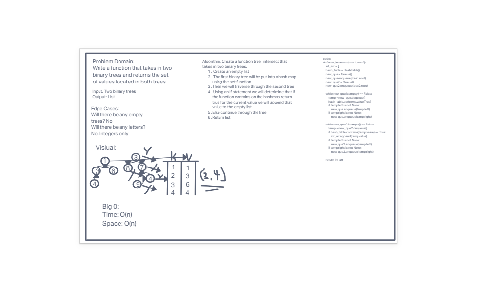

# Tree Intersection

- Write a function called `tree_intersection` that takes two binary trees as parameters.
- Using your Hash-map implementation as a part of your algorithm, return a set of values found in both trees.

## White Board

## Approach & Efficiency

- With this challenge I took the approach of iterating through the first tree and applying its values to a hash-map. From there I could use the built in functions to iterate through the second tree and see if it is the hash-map

## Solution

- Used the *Breadth-First* method to go through the trees. For the first tree I set the values as keys in a hash-map. For the second tree I used an if statement that if the hash-map function *contains* comes back `TRUE` then the value will be appended to a empty list. Once the iteration is complete the function returns the list.